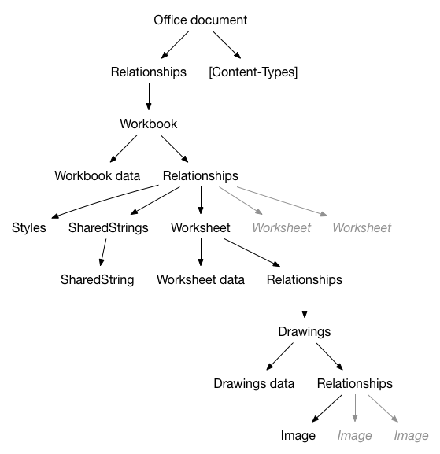

#XlsxReaderWriter

XlsxReaderWriter is an Objective-C library for iPhone / iPad and Mac. It parses and writes Excel OpenXml files (XLSX).

##Features

XlsxReaderWriter is able to:

* Read a spreadsheet document (XLSX file)
* Save a spreadsheet document
* Create worksheet
* Copy worksheet
* Remove worksheet
* Read cells content (Formula, error, string, attributed string, formatted number, boolean, date)
* Write cells content (Formula, error, string, attributed string, formatted number, boolean, date)
* Get images
* Add images (JPEG or PNG)
* Add/remove rows in sheets
* Add/remove columns in sheets
* Change number formatting
* Read content from merge cells
* Get cell fill as a UIColor
* Change cell fill
* ... many other things

Todo:

* Add/remove columns in sheets
* Create spreadsheet document from scratch
* Improve number formatting
* Borders
* Add better support for comments (add, remove, read)

##Limitation

XlsxReaderWriter can't create a SpreadsheetML (XLSX) file from scratch. You have to open an existing file and modify it before saving it. Not really a problem: Create your file with Excel or Numbers with all the needed formatting (fills, borders, etc.) then include the file as a resource of your project.

##Third parties

Third parties are included in this repository, not linked as git submodules.

* SSZipArchive: Compression/decompression library
* XMLDictionary: Converts XML to NSDictionary and NSDictionary to XML

##Linking (Objective-C)

To include the library to your Xcode project:

* Create a new project or open an existing project
* Insert **XlsxReaderWriter.xcodeproj** as a sub project of your project
* In your target **Build phases** insert **XlsxReaderWriter** as a target dependency
* Add **libXlsxReaderWriter.a** and **libz.tbd** in **Link binary with Libraries**. Older systems can use **libz.dylib** instead of **libz.tbd**.
* Add **-all_load** in **Linking / Other Linker Flags** in your project settings
* Add the XlsxReaderWriter root directory path to **User Header Search Paths** and set it as recursive. For example, set the path to *"$(SRCROOT)/XlsxReaderWriter/"*, not *"$(SRCROOT)/XlsxReaderWriter/XlsxReaderWriter/"*.

Now, you can import BRAOfficeDocumentPackage.h in your code.

##Linking (Swift bridging)

If you want to use this library from some Swift code, be sure to follow the same steps as in the Objective-C linking, then:

* you should **#import "XlsxReaderWriter-swift-bridge.h"** in your bridge header file
* if you don't have any bridge header file, create a new .h file, and **#import "XlsxReaderWriter-swift-bridge.h"**
* Set the path to your bridge file in your project settings : **Swift Compiler - Code Generation / Objective-C Bridging Header**. 

More info about this could be find [here](https://developer.apple.com/library/ios/documentation/Swift/Conceptual/BuildingCocoaApps/MixandMatch.html)

##How to 
####Read a spreadsheet document (XLSX file)
#####Objective-C
```objective-c
NSString *documentPath = [[NSBundle mainBundle] pathForResource:@"testWorkbook" ofType:@"xlsx"];
BRAOfficeDocumentPackage *spreadsheet = [BRAOfficeDocumentPackage open:documentPath];
```	
#####Swift
```swift
var documentPath: String = NSBundle.mainBundle().pathForResource("testWorkbook", ofType: "xlsx")
var spreadsheet: BRAOfficeDocumentPackage = BRAOfficeDocumentPackage.open(documentPath)
```
####Save a spreadsheet document
#####Objective-C
```objective-c
//Save
[spreadsheet save];
	
//Save a copy
NSString *fullPath = [[NSSearchPathForDirectoriesInDomains(NSDocumentDirectory, NSUserDomainMask, YES) lastObject] stringByAppendingPathComponent:@"workbookCopy.xlsx"];
[spreadsheet saveAs:fullPath];
```
#####Swift
```swift
//Save
spreadsheet.save()

//Save a copy
var fullPath: String = NSSearchPathForDirectoriesInDomains(NSDocumentDirectory, NSUserDomainMask, true).lastObject().stringByAppendingPathComponent("workbookCopy.xlsx")
spreadsheet.saveAs(fullPath)
```
####Get a worksheet
#####Objective-C
```objective-c
//First worksheet in the workbook
BRAWorksheet *firstWorksheet = spreadsheet.workbook.worksheets[0];
	
//Worksheet named "Foo"
BRAWorksheet *fooWorksheet = [spreadsheet.workbook createWorksheetNamed:@"Foo"];
```	
#####Swift
```swift
//First worksheet in the workbook
var firstWorksheet: BRAWorksheet = spreadsheet.workbook.worksheets[0]
	
//Worksheet named "Foo"
var fooWorksheet: BRAWorksheet = spreadsheet.workbook.createWorksheetNamed("Foo")
```
####Read cells content: Formula
#####Objective-C
```objective-c
NSString *formula = [[worksheet cellForCellReference:@"B4"] formulaString]
```
#####Swift
```swift
var formula: String = worksheet.cellForCellReference("B4").formulaString()
```
####Read cells content: error
#####Objective-C
```objective-c
NSString *errorValue = nil;
if ([[worksheet cellForCellReference:@"B2"] hasError]) {
	errorValue = [[worksheet cellForCellReference:@"B2"] stringValue];
}
```	
#####Swift
```swift
var errorValue: String? = nil
if worksheet.cellForCellReference("B2").hasError() {
	errorValue = worksheet.cellForCellReference("B2").stringValue()
}
```
####Read cells content: string
#####Objective-C
```objective-c
NSString *string = [[worksheet cellForCellReference:@"B6"] stringValue];
```
#####Swift
```swift
var string: String = worksheet.cellForCellReference("B6").stringValue()
```
####Read cells content: attributed string
#####Objective-C
```objective-c
//Cell style is applied to the cell content
NSAttributedString *attributedString = [[worksheet cellForCellReference:@"B5"] attributedStringValue];
```
#####Swift
```swift
//Cell style is applied to the cell content
var attributedString: NSAttributedString = worksheet.cellForCellReference("B5").attributedStringValue()
```
####Read cells content: formatted number
#####Objective-C
```objective-c
//Integer cell value
NSInteger cellIntValue = [[worksheet cellForCellReference:@"B5"] integerValue];

//Float cell value
CGFloat cellFloatValue = [[worksheet cellForCellReference:@"B5"] floatValue];

//Formatted number cell value
CGFloat cellFloatValue = [[worksheet cellForCellReference:@"B5"] stringValue];
```	
#####Swift
```swift
//Integer cell value
var cellIntValue: Int = CInteger(worksheet.cellForCellReference("B5"))!
	
//Float cell value
var cellFloatValue: CGFloat = CFloat(worksheet.cellForCellReference("B5"))!
	
//Formatted number cell value
var cellFloatValue: CGFloat = worksheet.cellForCellReference("B5").stringValue()
```
####Read cells content: boolean
#####Objective-C
```objective-c
BOOL cellTruth = [[worksheet cellForCellReference:@"B5"] boolValue];
```
#####Swift
```swift
var cellTruth: Bool = CBool(worksheet.cellForCellReference("B5"))!
```
####Write cells content: Formula
#####Objective-C
```objective-c
[[worksheet cellForCellReference:@"Y26" shouldCreate:YES] setFormulaString:@"TODAY()"];
```
#####Swift
```swift
worksheet.cellForCellReference("Y26", shouldCreate: true).formulaString = "TODAY()"
```
####Write cells content: error
#####Objective-C
```objective-c
[[worksheet cellForCellReference:@"Y27" shouldCreate:YES] setError:@"#DIV/0!"];
```
#####Swift
```swift
worksheet.cellForCellReference("Y27", shouldCreate: true).error = "#DIV/0!"
```
####Write cells content: string
#####Objective-C
```objective-c
[[worksheet cellForCellReference:@"Y24" shouldCreate:YES] setStringValue:@"FOO / BAR"];
```
#####Swift
```swift
worksheet.cellForCellReference("Y24", shouldCreate: true).stringValue = "FOO / BAR"
```
####Write cells content: attributed string
#####Objective-C
```objective-c
[[worksheet cellForCellReference:@"Z24" shouldCreate:YES]
setAttributedStringValue:[[NSAttributedString alloc] initWithString:@"RED is not GREEN" attributes:@{NSForegroundColorAttributeName: [UIColor greenColor]}]];
```
#####Swift
```swift
worksheet.cellForCellReference("Z24", shouldCreate: true).attributedStringValue = NSAttributedString(string: "RED is not GREEN", attributes: [NSForegroundColorAttributeName: UIColor.greenColor()])
```
####Write cells content: formatted number
#####Objective-C
```objective-c
[[worksheet cellForCellReference:@"Z23" shouldCreate:YES] setFloatValue:12.3];
[[worksheet cellForCellReference:@"Z23"] setNumberFormat:@"0.000"];
```
#####Swift
```swift
worksheet.cellForCellReference("Z23", shouldCreate: true).floatValue = 12.3
worksheet.cellForCellReference("Z23").numberFormat = "0.000"
```
####Write cells content: boolean
#####Objective-C
```objective-c
[[worksheet cellForCellReference:@"Z21" shouldCreate:YES] setBoolValue:NO];
```
#####Swift
```swift
worksheet.cellForCellReference("Z21", shouldCreate: true).boolValue = false
```
####Write cells content: date
#####Objective-C
```objective-c
NSDateFormatter *df = [[NSDateFormatter alloc] init];
df.dateFormat = @"MM/dd/yyyy";
[[worksheet cellForCellReference:@"Y25" shouldCreate:YES] setDateValue:[df dateFromString:@"10/07/1982"]];
[[worksheet cellForCellReference:@"Y25"] setNumberFormat:@"m/d/yyyy"];
```
#####Swift
```swift
var df: NSDateFormatter = NSDateFormatter()
df.dateFormat = "MM/dd/yyyy"
worksheet.cellForCellReference("Y25", shouldCreate: true).dateValue = df.dateFromString("10/07/1982")
worksheet.cellForCellReference("Y25").numberFormat = "m/d/yyyy"
```
####Get cell fill as a UIColor
#####Objective-C
```objective-c
UIColor *cellFillColor = [[worksheet cellForCellReference:@"A35"] cellFillColor];
```
#####Swift
```swift
var cellFillColor: UIColor = worksheet.cellForCellReference("A35").cellFillColor()
```
####Change cell fill
#####Objective-C
```objective-c
[[worksheet cellForCellReference:@"A36" shouldCreate:YES] setCellFillWithForegroundColor:[UIColor yellowColor] backgroundColor:[UIColor blackColor] andPatternType:kBRACellFillPatternTypeDarkTrellis];
```
#####Swift
```swift
worksheet.cellForCellReference("A36", shouldCreate: true).setCellFillWithForegroundColor(UIColor.yellowColor(), backgroundColor: UIColor.blackColor(), andPatternType: kBRACellFillPatternTypeDarkTrellis)
```
####Get images
#####Objective-C
```objective-c
//Works with oneCellAnchor or twoCellAnchored image
UIImage *image = [worksheet imageForCellReference:@"G8"].uiImage;
```
#####Swift
```swift
//Works with oneCellAnchor or twoCellAnchored image
var image: UIImage = worksheet.imageForCellReference("G8").uiImage
```
####Add images (JPEG or PNG)
#####Objective-C
```objective-c
UIImage *image = [UIImage imageNamed:@"Kitten.jpeg"];
//preserveTransparency force JPEG (NO) or PNG (YES)
BRAWorksheetDrawing *drawing = [worksheet addImage:image betweenCellsReferenced:@"G2" and:@"I10"withInsets:UIEdgeInsetsZero preserveTransparency:NO];
//Set drawing insets (percentage)
drawing.insets = UIEdgeInsetsMake(0., 0., .5, .5);
```
#####Swift
```swift
var image: UIImage = UIImage(named: "Kitten.jpeg")
//preserveTransparency force JPEG (NO) or PNG (YES)
var drawing: BRAWorksheetDrawing = worksheet.addImage(image, betweenCellsReferenced: "G2", and: "I10", withInsets: UIEdgeInsetsZero, preserveTransparency: false)
//Set drawing insets (percentage)
drawing.insets = UIEdgeInsetsMake(0.0, 0.0, 0.5, 0.5)
```
####Add/remove rows in sheets
#####Objective-C
```objective-c
//Insert one row before 18th row
[worksheet addRowsAt:18];
//Remove it
[worksheet removeRow:18];

//Insert 10 rows before 18th row
[worksheet addRowsAt:18 count:10];
//Remove them
[worksheet removeRow:18 count:10];
```
#####Swift
```swift
//Insert one row before 18th row
worksheet.addRowsAt(18)
//Remove it
worksheet.removeRow(18)

//Insert 10 rows before 18th row
worksheet.addRowsAt(18, count: 10)
//Remove them
worksheet.removeRow(18, count: 10)
```
####Add/remove columns in sheets

	TODO
	
####Change number formatting
#####Objective-C
```objective-c
[[worksheet cellForCellReference:@"Y25"] setNumberFormat:@"_(0.00_);(0.00)"];
```
#####Swift
```swift
worksheet.cellForCellReference("Y25").numberFormat = "_(0.00_);(0.00)"
```
####Read content from merge cells
#####Objective-C
```objective-c
//Get the cell at C10 or the upper-left cell if C10 belongs to a merge cell
BRACell *cell = [worksheet cellOrFirstCellInMergeCellForCellReference:@"C10"]
```
#####Swift
```swift
//Get the cell at C10 or the upper-left cell if C10 belongs to a merge cell
var cell: BRACell = worksheet.cellOrFirstCellInMergeCellForCellReference("C10")
```
####Create worksheet
#####Objective-C
```objective-c
BRAWorksheet *worksheet = [spreadsheet.workbook createWorksheetNamed:@"Foo"];
```
#####Swift
```swift
var worksheet: BRAWorksheet = spreadsheet.workbook.createWorksheetNamed("Foo")
```
####Copy worksheet
#####Objective-C
```objective-c
BRAWorksheet *worksheetToCopy = spreadsheet.workbook.worksheets[0];
BRAWorksheet *worksheet = [spreadsheet.workbook createWorksheetNamed:@"Foo" byCopyingWorksheet:worksheetToCopy];
```
#####Swift
```swift
var worksheetToCopy: BRAWorksheet = spreadsheet.workbook.worksheets[0]
var worksheet: BRAWorksheet = spreadsheet.workbook.createWorksheetNamed("Foo", byCopyingWorksheet: worksheetToCopy)
```
####Remove worksheet
#####Objective-C
```objective-c
[_spreadsheet.workbook removeWorksheetNamed:@"Foo"];
```
#####Swift
```swift
spreadsheet.workbook.removeWorksheetNamed("Foo")
```
####Do some simple operation from Swift
```swift
let documentPath = NSBundle.mainBundle().pathForResource("testWorkbook", ofType: "xlsx")
        
let odp = BRAOfficeDocumentPackage.open(documentPath)
let worksheet: BRAWorksheet = odp!.workbook.worksheets[0] as! BRAWorksheet;

NSLog("%@", worksheet.cellForCellReference("A1").attributedStringValue())
        
let paths: Array = NSSearchPathForDirectoriesInDomains(NSSearchPathDirectory.DocumentDirectory, NSSearchPathDomainMask.UserDomainMask, true) as Array
let fullPath: String = (paths[0] as! String).stringByAppendingString("testSaveAs.xlsx")
odp!.saveAs(fullPath)
```
##A word about XLSX files

XLSX files are OPC packages (see ECMA-376 for more information). Below is a simplified hierarchical representation of the package contents.



Files have relationships, files are relationships... Have a look at this picture each time you want to change something in the library.

##License	

Copyright (c) 2014-2016 Ren&eacute; BIGOT.

Copyright (c) 2015 Fabian Pahl (Cocoa pods integration).

Copyright (c) 2016 Sam Hatchett (Mac port).

The XlsxReaderWriter library should be accompanied by a LICENSE file. This file contains the license relevant to this distribution. If no license exists, please contact me [@renebigot](https://twitter.com/renebigot).
